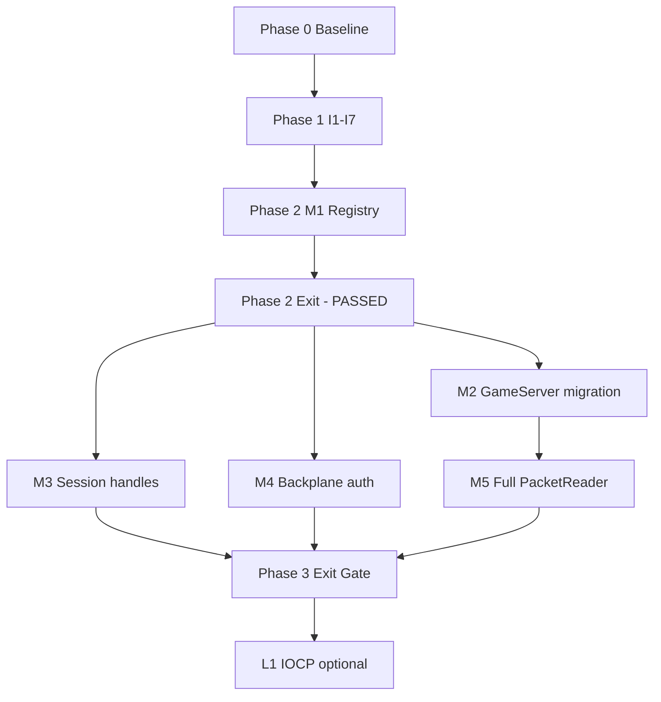

# MMORPG Packet Infrastructure Audit & Modernization Study

**Project:** `devk` (PKO private server + client)  
**Last updated:** 2026-06-27  
**Execution tracker:** [`helper/network-tests/STATUS.md`](../helper/network-tests/STATUS.md)  
**Baseline inventory:** [`helper/network-tests/BASELINE.md`](../helper/network-tests/BASELINE.md)

This document is the master audit (Phases 1–6). Phases 0–2 have been executed in code; Phases 3–6 define the remaining roadmap under **Option B** (partial refactor, wire-compatible).

---

## Executive summary

The stack is a **2003-era `dbc` transport** (`select()` + thread pools + length-prefixed frames) used by Account, Group, Gate, Game servers and the game client. Modern hardening has been layered on: Botan RSA/AES, `PacketSanitizer`, player-pointer registry, rate limiting, fail-closed parse pipeline, and opcode/handler registry pilots on Gate.

**Verdict:** Suitable to operate and worth **incremental modernization (Option B)** — not a full rewrite. Strengths: net/logic thread separation, pooled buffers, real client handshake. Liabilities: `select()` scale ceiling, legacy switch dispatch on GameServer, raw-pointer identity on backplane, unencrypted inter-server links.

### Ops — SessionManager capacity (F-07, F-08)

Each `SessionManager` instance (Gate, Group, Game per gate link) uses a **fixed 65536-slot** table (`SessionManager::kMaxSlots`). Slots are reused via a generation-stamped free list; exhaustion returns an invalid handle and logs `SessionManager Allocate REJECT` with an active-count estimate (`m_nextSlot - freeList.size()`). Monitor this log under high concurrency; sustained rejects mean the cap is reached for that process.

### Ops — Backplane PSK misconfiguration (F-04)

`RequireAuth=1` with an empty `[Backplane] PSK` is **fail-closed at startup**: `BackplaneAuth::SetClusterConfig` logs `FATAL` and exits. Set a non-empty shared PSK on all four server cfgs, or use `RequireAuth=0` for legacy (unauthenticated) inter-server links.

**Production validation (2026-06-27):** Login → character select → enter world → chat confirmed after:
- Raising client packet limits to 32 KB (`NetLimits.h`) for large login responses
- Running Gate SyncCall opcodes on the comm thread (login, begin-play, etc.) to avoid packet-age timeouts

---

## Phase 1 — Existing architecture

### 1.1 Topology

```
                 ┌────────────┐   CMD_PA/AP   ┌───────────────┐
                 │AccountServer│◄────RPC──────►│  GroupServer  │
                 └────────────┘               └───────┬───────┘
                                                       │ CMD_TP/PT, CMD_PM/MP
   ┌────────┐  CMD_CM/MC, CMD_CP/PC  ┌────────┴──────┐  CMD_TM/MT
   │ Client │◄──────(gate only)─────►│  GateServer   │◄──────────►│ GameServer(s)
   │ NetIF  │   RSA→AES             │ ToClient      │            │ GameServerApp
   └────────┘                        │ ToGameServer  │            └──────────────┘
                                     │ ToGroupServer │
                                     └───────────────┘
```

The **Gate** is the only server the client talks to. It routes by opcode band (`NetCommand.h`, 500-ID blocks).

### 1.2 Packet pipeline (concrete bindings)

```
Socket          DataSocket::m_socket
  ↓
Receive buffer  rbuf (PreAllocHeap, Receiver.cpp)
  ↓
Framer          Receiver::Process — 2-byte BE length, cmd at payload start
  ↓
Decrypt         OnDecrypt (client link only; AES-CTR or AES-GCM)
  ↓
RPC demux       RPCMGR::ProcessSESS (SyncCall correlation)
  ↓
Dispatch        TcpCommApp::OnProcessData (per-app)
  ↓
Game thread     PKQueue::PeekPacket (GameServer main loop)
  ↓
Handler         switch(cmd) → ProcessPacket → BeginAction → Cmd_*
  ↓
Response        WPacket → Sender queue → socket
```

| Stage | Primary files |
|-------|----------------|
| Transport | `serversdk/Comm.cpp`, `DataSocket.cpp`, `Receiver.cpp`, `Sender.cpp` |
| Packets | `serversdk/Packet.cpp`, `common/NetCommand.h` |
| Gate client path | `gateserver/ToClient.cpp` |
| Gate routing | `ToGameServer.cpp`, `ToGroupServer.cpp` |
| Game dispatch | `gameserver/GameAppNet.cpp`, `CharacterPrl.cpp` |
| Client | `game/NetIF.cpp`, `PacketCmd_SC.cpp`, `ProCirculateCS.cpp` |
| Sessions | `gateserver/GateServer.cpp` (`Player`, `ValidatePlayerPointer`) |

### 1.3 Threading model

- **Communicator pool:** `select()` loop, per-socket recv/send tasks  
- **Processor pool:** optional; Gate `ToClient` uses `mode=false` → many handlers run **inline on comm thread**  
- **Game logic:** single thread via `PKQueue` (by design)

**Critical operational rule (learned in production):** Any handler that performs **SyncCall to GroupServer** (login, begin-play, end-play, new/del char) must run on the **comm thread immediately**, not via queued `TransmitCall`. Queuing lets `recvbuf` age past the 10s deadline → `ERR_MC_NETEXCP` / disconnect reason `-5`.

### 1.4 Authentication flow (client → gate)

1. TCP → gate `:1973`
2. `CMD_MC_RSA_HANDSHAKE_1` (server RSA-3072 PEM)
3. `CMD_CM_RSA_HANDSHAKE_1` (client key material)
4. `CMD_MC_RSA_HANDSHAKE_2` (AES key+IV, `CommEncrypt` flag)
5. `CMD_CM_LOGIN` (encrypted credentials + version `32144`)
6. Gate → Group → Account; `CMD_MC_LOGIN` (errno + character list)
7. Wire encryption enabled (AES-CTR or GCM per config)

### 1.5 Enter-world flow (character select)

1. Client → `CMD_CM_BGNPLAY` (433) with character name  
2. Gate → `CMD_TP_BGNPLAY` SyncCall → GroupServer (`TP_BGNPLAY`)  
3. Group validates char, returns map name + db id  
4. Gate kicks duplicate sessions on all GameServers (`CMD_TM_KICKCHA`)  
5. Gate → `GameServer::EnterMap` → client receives `CMD_MC_BGNPLAY` / map enter via game path  

Same **comm-thread SyncCall rule** applies as login.

---

## Phase 2 — Problems identified (original audit)

Full detail with code paths was documented 2026-06-26. Summary by category:

### Security (addressed in Sprint 1 unless noted)

| ID | Issue | Status |
|----|-------|--------|
| S1 | Unbounded 64 KB recv alloc | **Fixed** — `NetLimits.h`, capped alloc in `Receiver.cpp` |
| S2 | Raw pointer identity on wire | **Mitigated** — registry + generation; **M3** remains for slot handles |
| S3 | Inconsistent `ReadString`/`ReadSequence` contract | **Fixed** — I4 + `PacketReader` |
| S4 | Plaintext backplane | **Open** — M4 |
| S5 | Exception swallowing | **Fixed** — I5 + `PacketPipeline.h` |
| S6 | Log-only flood detection | **Fixed** — I1 rate limits in `ToClient.cpp` |
| S7 | Disconnect races / UAF risk | **Partial** — I7 atomics; **L2** FSM remains |

### Stability

| ID | Issue | Status |
|----|-------|--------|
| ST1 | Flag-soup teardown | Open — L2 |
| ST2 | `select()` FD_SETSIZE / O(n) poll | Open — L1 IOCP |
| ST3 | Send queue growth | Monitored; cap exists |
| ST4 | `GetTickCount` wrap | **Fixed** — I3 steady clock |

### Performance

| ID | Issue | Status |
|----|-------|--------|
| P1 | `Duplicate()` + grow on every gate ReRoute forward | **Fixed** — M6 `ForwardFromReceive` (2026-07-01) |
| P2 | WPacket grow loop | Open — low priority |
| P3 | Global lock on player registry | Open — M3 |
| P4 | Full socket list walk every 2 ms | Open — L1 |

### Maintainability

| ID | Issue | Status |
|----|-------|--------|
| M1 | Giant switch dispatch | **In progress** — OpcodeMeta + Gate registry |
| M2 | `cmd/500` band math | **In progress** — OpcodeMeta direction bands |
| M3 | Dead/legacy code volume | Ongoing cleanup |
| M4 | `volatile` as sync | **Fixed** — I7 |
| M5 | Shared SDK coupling | Accepted tradeoff |

### Production incidents (post-audit)

| Symptom | Root cause | Fix |
|---------|------------|-----|
| Login overlay vanishes, no char select | Login response ~18 KB > 16 KB client max → disconnect `-5` | `kClientGameMaxPacket` / `kClientMaxPacket` → 32768 |
| "GateServer exceptional line error" on Enter | `CM_BGNPLAY` queued to processor pool; packet aged out >10s | `DispatchSyncClientOpcode` on comm thread |
| Wrong password works, correct fails | Same as row 1 (small error packet fits limit) | Same packet limit fix |

---

## Phase 3 — Comparison to modern MMORPG standards

| Layer | Modern practice | This codebase (2026-06-27) | Verdict |
|-------|-----------------|---------------------------|---------|
| **Connection** | Session manager, explicit FSM | `DataSocket` + `Player` + registry; flags not FSM | ⚠️ Partial |
| **Packet** | Opcode registry, typed handlers | `OpcodeMeta` + Gate `OpcodeHandlerRegistry`; Game still switch | ⚠️ Partial |
| **Processing** | Net / worker / logic separation | Communicator + PKQueue + single game thread | ✅ Good |
| **Reliability** | Validation, rate limit, fail-closed | Sanitizer, I1 limits, I5 pipeline, login rate limit | ✅ Good (client path) |
| **Memory** | Pools, size classes | `PreAllocHeap` / `rbuf` refcount | ✅ Good |
| **Scalability** | IOCP / epoll / kqueue | `select()` only | ❌ Legacy ceiling |
| **Crypto (client)** | TLS or AEAD | RSA-3072 + AES-CTR/GCM on client link | ✅ Good |
| **Crypto (backplane)** | mTLS / PSK | Plaintext TCP | ❌ Gap |

---

## Phase 4 — Refactoring options

### Option A — Patch only

- **Pros:** Low risk, fast  
- **Cons:** Leaves dispatch debt and `select()` ceiling  
- **Effort:** 1–3 weeks  
- **Status:** Largely superseded by completed Sprint 1

### Option B — Partial refactor (**recommended, in progress**)

- Handler registry, typed readers, session handles, backplane auth, bounded alloc  
- Wire format unchanged; incremental migration  
- **Effort:** ~2–4 months remaining for Phase 3 tracks  
- **Risk:** Medium  

### Option C — Full redesign

- New transport + schema + wire protocol  
- **Effort:** 9–18 months; breaks compatibility  
- **Risk:** High — not recommended for live PKO fork

---

## Phase 5 — Target architecture (Option B end state)

| Layer | Target | Wire impact |
|-------|--------|-------------|
| **Network** | `INetTransport` abstraction; IOCP behind flag for Gate | None until L1 |
| **Packet** | `OpcodeMeta` table drives direction, min size, auth, rate | None |
| **Dispatch** | `HandlerRegistry` replaces switches; GameServer bulk migration | None |
| **Session** | Slot + generation handles (8 bytes, same as today) | None (internal layout) |
| **Security** | GCM on client link (**done**), backplane PSK (**M4**), centralized validation | GCM needs version gate |
| **Threading** | Keep single game thread; atomics on I/O path (**done**) | None |
| **Memory** | Size-class pools; zero-copy gate forward (**M6**) | None |

---

## Phase 6 — Roadmap & current position

### Completed

| Phase | Items |
|-------|--------|
| **0** | Opcode CSV, BASELINE, `net-smoke.py`, `NET_AUDIT_DIAG` |
| **1** | I1–I7 (rate limit, caps, steady clock, atomics, GCM path, fail-closed, read contract) |
| **2** | M1 OpcodeMeta, M5-prep PacketReader/Writer, M2 Gate registry + pilots, ToClient bulk routing |
| **Hotfix** | 32 KB client limits; SyncCall on comm thread; login response forwarding |

### Phase 2 exit gate — **PASSED** (2026-06-27)

- [x] Release\|x64 build  
- [x] T0-connect / T0-ping (automated)  
- [x] T0-login, T0-enter, in-world chat (manual)  

### Phase 3 — Next work (parallel tracks)

| Track | Goal | Priority | Key files |
|-------|------|----------|-----------|
| **A — M3** | Slot+generation session handles | High | **Done** (phases 1–3 + phase 5 TP SyncCall, 2026-07-01) |
| **B — M2** | Migrate GameServer `CharacterPrl.cpp` to registry | High | **Done** — 112 handlers |
| **B — M2** | Migrate GameServer `GameAppNet.cpp` to registry | High | **Done** — 35 handlers |
| **C — M6** | Zero-copy gate forward (drop `Duplicate()` on ReRoute) | Med | **Done** — `ForwardFromReceive` in `ToClient.cpp` |
| **D — M4** | Backplane PSK / mutual auth | High | `Comm.cpp`, `ToGameServer.cpp`, `ToGroupServer.cpp` |
| **E — M5** | PacketReader rollout + opcode-table-driven validation | Med | All CM/CP handlers |

**Suggested order:** Track A complete. **Next:** Phase 3 exit soak (30 min) or Track C (zero-copy gate forward).

### Phase 4 — Long-term (after Phase 3 exit)

| ID | Trigger | Work |
|----|---------|------|
| L1 | >500 concurrent clients or select CPU bound | IOCP transport, gate first |
| L2 | UAF/disconnect race in logs | Formal connection FSM |
| L3 | Frequent new opcodes | Schema/codegen |
| L4 | Commercial anti-cheat | Per-opcode hooks in registry |
| L5 | Multi-client-version support | Dedicated version negotiate packet |

---

## Dependency graph



---

## How to resume work

1. Read [`helper/network-tests/STATUS.md`](../helper/network-tests/STATUS.md)  
2. Pick the first unchecked Phase 3 track task  
3. One concern per commit; run T0 suite + affected manual path  
4. Update STATUS.md and this doc when exit gates pass  

**Copy-paste for agents:**

> Continue Option B / Phase-6. Phase 3 in progress. **Track A phase 5 next** — full TP SyncCall session migration. Read `helper/network-tests/STATUS.md` (Track A phase 5) and `docs/PACKET_SYSTEM_REFACTOR.md`. Wire size unchanged (16-byte trailer).

---

## References

| Document | Purpose |
|----------|---------|
| [`docs/PACKET_SYSTEM_REFACTOR.md`](PACKET_SYSTEM_REFACTOR.md) | Change log & architecture guide for packet refactor (Tracks A–E) |
| [`helper/network-tests/BASELINE.md`](../helper/network-tests/BASELINE.md) | Build targets, ports, limits, smoke tests |
| [`helper/network-tests/data/opcodes.csv`](../helper/network-tests/data/opcodes.csv) | Machine-readable opcode inventory |
| [`docs/SECURITY_AUDIT.md`](SECURITY_AUDIT.md) | Broader security review (DB, auth) |
| Commit `665a8778` | Login / begin-play / packet limit fixes |
